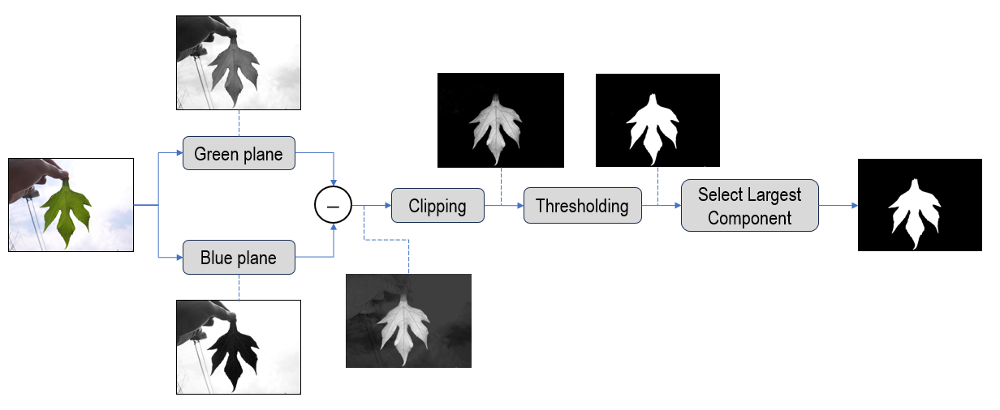
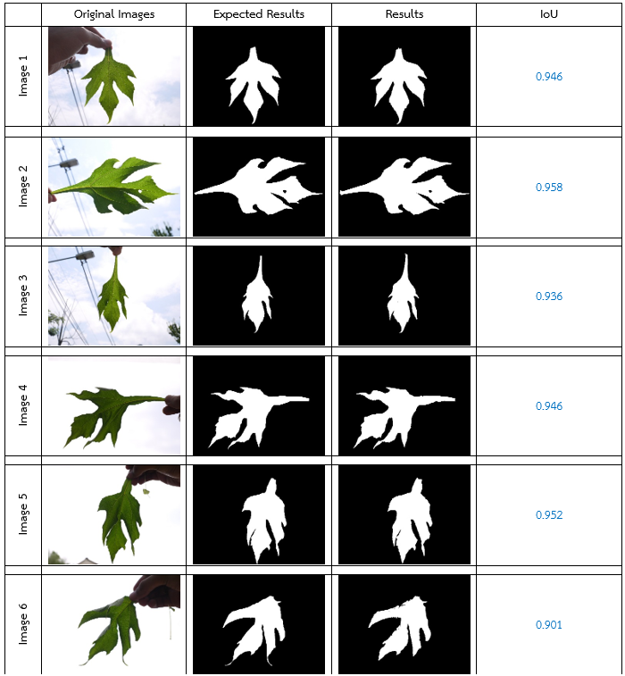
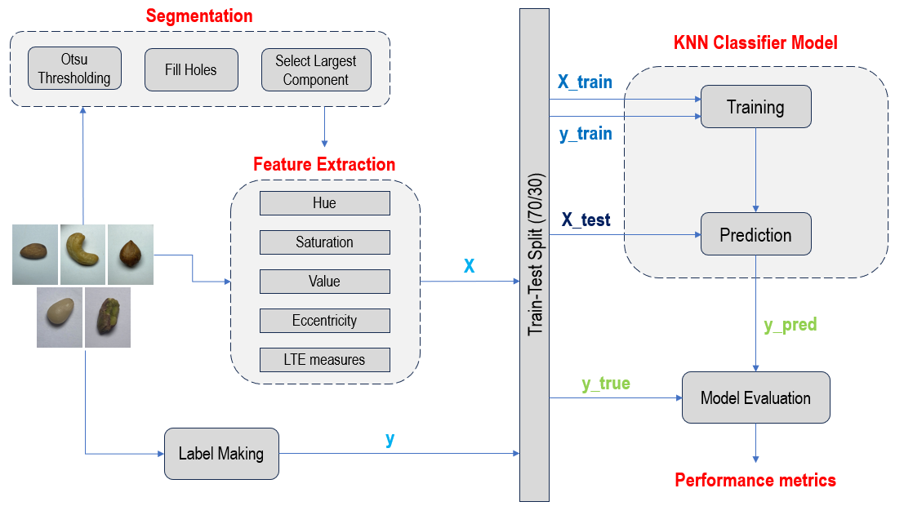
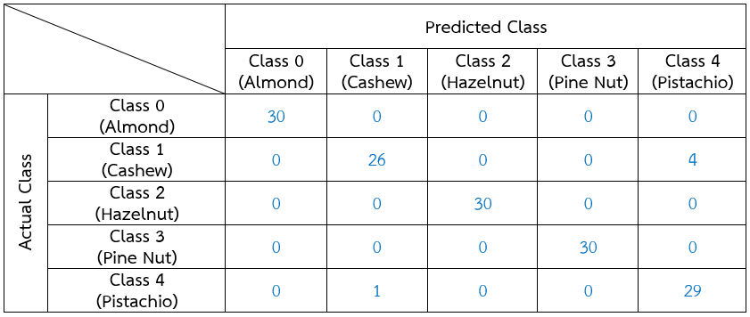
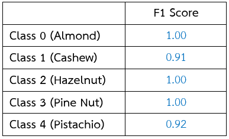

# IAR2024: Answer Examination (Example)

* AngKhang Leaf Image Datasets from **Kasetsart Signal and Image Processing Laboratory (KSIP Lab)**

* Nut Image Datasets from https://www.kaggle.com/datasets/ruopengan/11-common-nut-types-for-image-classification

## Leaf Segmentation

  

### IoU

  

## Nut Classification

  

### IoU

  

### F1-score

  

